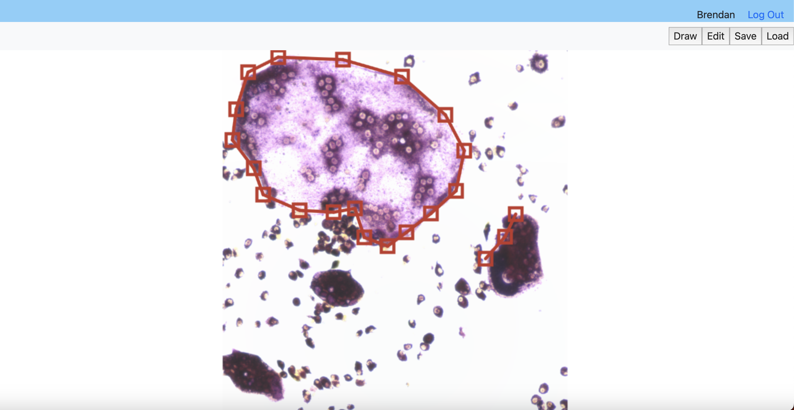

# Instructions

Running the demo:

This project requires an environement with flask installed. A suitable requirements file is available in the main folder.

        conda env create --name <env_name> --file requirements_simplified.yml

In the environment with flask installed, cd to the main folder. The first time you use the app, you will need to initialize the database:

        flask --app flask_tmp init-db

Then, you can run the application with:

        flask --app flask_tmp run --debug

Then, open the associated link.

The landing paage provides some information on the features offered by the application and how to use them. From here, a user may either try the free demo with limited features. or register with the application to access all features.

On the Gallery page, you may click on any of your previously saved images to move to the Creation page. There, the "Draw" button will allow you to click on the area of the image to add new polygons by placing individual vertices. Clicking on the first-placed point will complete the polygon. The "Edit" mode will allow you to manipulate already placed vertices. The "Save button" will save the current set of polygons to the backend database. The "Load button" will then load the last set of saved polygons.

An unregistered user will not have access to the Save or Load buttons, and their images will not be loaded on the Gallery page. None of this user's data will be saved long-term.

